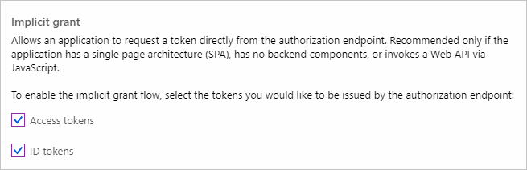

<!-- markdownlint-disable MD002 MD041 -->

在此练习中，你将使用 Azure Active Directory 管理中心创建新的 Azure AD Web 应用程序注册。

1. 打开浏览器，并转到 [Azure Active Directory 管理中心](https://aad.portal.azure.com)。 使用 **个人帐户**（亦称为“Microsoft 帐户”）或 **工作或学校帐户** 登录。

1. 选择左侧导航栏中的“**Azure Active Directory**”，再选择“**管理**”下的“**应用注册**”。

    

1. 选择“新注册”。 在“注册应用”页上，按如下方式设置值。

    - 将“名称”设置为“`Office Add-in Graph Tutorial`”。
    - 将“受支持的帐户类型”设置为“任何组织目录中的帐户和个人 Microsoft 帐户”。
    - 在“重定向 URI”下，将第一个下拉列表设置为“`Single-page application (SPA)`”，并将值设置为“`https://localhost:3000/consent.html`”。

    

1. 选择“**注册**”。 在 **"Office 外接程序图形** 教程"页上，复制"应用程序 (**客户端) ID"的值并** 保存它，下一步中将需要该值。

    

1. 选择“**管理**”下的“**身份验证**”。 找到 **隐式授予** 部分并启用 **访问令牌** 和 **ID 令牌**。 选择“**保存**”。

    

1. 选择“管理”下的“证书和密码”。 选择“新客户端密码”按钮。 在“**说明**”中输入值，并选择“**过期**”下的一个选项，再选择“**添加**”。

1. 离开此页前，先复制客户端密码值。 将在下一步中用到它。

    > [!IMPORTANT]
    > 此客户端密码不会再次显示，所以请务必现在就复制它。

1. 选择 **"管理"下的"API** **权限"，** 然后选择"**添加权限"。**

1. 选择 **"Microsoft Graph"，** 然后选择 **"委派权限"。**

1. 选择以下权限，然后选择"**添加权限"。**

    - **offline_access** - 这将允许应用在令牌过期时刷新访问令牌。
    - **Calendars.ReadWrite** - 这将允许应用读取和写入用户的日历。
    - **MailboxSettings.Read** - 这将允许应用从用户的邮箱设置获取用户的时区。

    

## 配置 Office 加载项单一登录

在此部分中，你将更新应用程序注册，以支持 [SSO ](https://docs.microsoft.com/office/dev/add-ins/develop/sso-in-office-add-ins) (Office 外接程序) 。

1. 选择 **"公开 API"。** 在"**此 API 定义的范围**"部分，选择"**添加范围"。** 当系统提示设置应用程序 **ID URI** 时，将值设置为 `api://localhost:3000/YOUR_APP_ID_HERE` ， `YOUR_APP_ID_HERE` 将 替换为应用程序 ID。 选择 **"保存"，然后继续**。

1. 按如下所示填写字段，然后选择"**添加范围"。**

    - **范围名称：**`access_as_user`
    - **谁可以同意？：管理员和用户**
    - **管理员同意显示名称：**`Access the app as the user`
    - **管理员同意说明：**`Allows Office Add-ins to call the app's web APIs as the current user.`
    - **用户同意显示名称：**`Access the app as you`
    - **用户同意说明：**`Allows Office Add-ins to call the app's web APIs as you.`
    - **状态：已启用**

    

1. 在"**授权客户端应用程序"** 部分，选择 **"添加客户端应用程序"。** 从以下列表中输入客户端 ID，在"授权范围"下启用范围，然后选择"**添加应用程序"。** 对列表中的每个客户端 ID 重复此过程。

    - `d3590ed6-52b3-4102-aeff-aad2292ab01c` (Microsoft Office)
    - `ea5a67f6-b6f3-4338-b240-c655ddc3cc8e` (Microsoft Office)
    - `57fb890c-0dab-4253-a5e0-7188c88b2bb4`（Office 网页版）
    - `08e18876-6177-487e-b8b5-cf950c1e598c`（Office 网页版）
