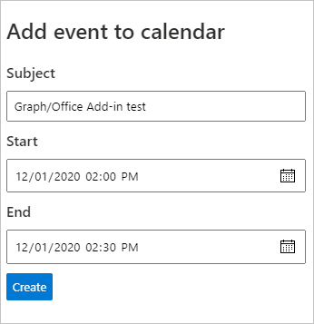

<!-- markdownlint-disable MD002 MD041 -->

在此部分中，您将添加在用户日历上创建事件的能力。

## 实现 API

1. 打开 **./src/api/graph.ts** 并添加以下代码，以实施新的事件 API `POST /graph/newevent` () 。

    :::code language="typescript" source="../demo/graph-tutorial/src/api/graph.ts" id="CreateEventSnippet":::

1. 打开 **./src/addin/taskpane.js** 并添加以下函数以调用新的事件 API。

    :::code language="javascript" source="../demo/graph-tutorial/src/addin/taskpane.js" id="CreateEventSnippet":::

1. 保存所有更改，重新启动服务器，并刷新 Excel 中的任务窗格 (关闭任何打开的任务窗格，然后重新打开) 。

    

1. 填写表单，然后选择"创建 **"。** 验证事件是否添加到用户日历。
